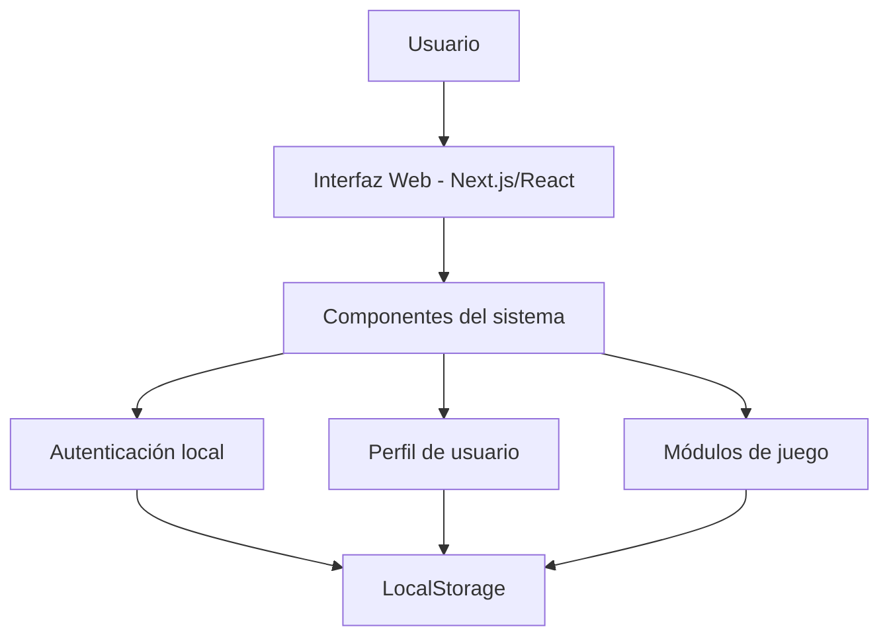

# Arquitectura del sistema

## Tipo de arquitectura utilizada
El sistema utiliza una **arquitectura cliente-servidor simplificada**, orientada en esta etapa principalmente al **cliente (frontend)**.

Aunque todavía no existe un backend completo desplegado con base de datos remota, la estructura del proyecto fue diseñada para que pueda evolucionar fácilmente hacia una arquitectura más completa con:
- frontend,
- backend,
- base de datos,
- autenticación real,
- servicios API.

Actualmente, el sistema sigue un enfoque **modular por componentes y rutas**, propio de aplicaciones desarrolladas con **Next.js y React**.

## Componentes principales

### 1. Frontend
Es la parte principal del sistema y contiene:
- interfaz visual,
- rutas del sistema,
- componentes reutilizables,
- lógica de interacción,
- formularios de autenticación,
- vistas del perfil,
- pantallas del juego.

### 2. Persistencia local
En esta fase del proyecto, los datos del usuario se almacenan en `localStorage`, lo cual permite:
- mantener sesión iniciada,
- guardar usuarios registrados,
- guardar selección de criatura,
- conservar estado básico entre recargas.

### 3. Base para backend futuro
Aunque todavía no se implementa una API real, la estructura del sistema permite incorporar posteriormente:
- autenticación con base de datos,
- servicios REST,
- almacenamiento persistente real,
- sincronización multijugador.

## Comunicación entre componentes
La comunicación se da de la siguiente forma:

- **Usuario → Interfaz**: el usuario interactúa con formularios, botones y vistas.
- **Interfaz → Componentes**: los componentes procesan eventos y actualizan el estado.
- **Componentes → LocalStorage**: se guardan o leen datos de sesión y perfil.
- **Rutas → Módulos de juego**: cada vista carga funciones específicas según la sección del sistema.

## Flujo general
1. El usuario entra al sistema.
2. Puede registrarse o iniciar sesión.
3. La aplicación valida los datos en el cliente.
4. La sesión se guarda localmente.
5. El usuario accede a su perfil y a las pantallas del juego.
6. La criatura activa y otros datos se mantienen en el navegador.

## Diagrama representativo en Mermaid

## Justificación de la arquitectura
Se eligió esta arquitectura porque:
- permite avanzar rápido en el prototipo,
- facilita la demostración funcional del sistema,
- separa vistas, lógica y navegación,
- permite crecer a una versión con backend real sin rehacer todo el proyecto.

## Ventajas del enfoque actual
- Desarrollo más rápido
- Fácil de probar localmente
- Menor complejidad inicial
- Buena base para futuras mejoras

## Limitaciones actuales
- No existe base de datos remota
- No existe API REST completa
- La autenticación es local
- La persistencia depende del navegador
- El multijugador real aún no está implementado
