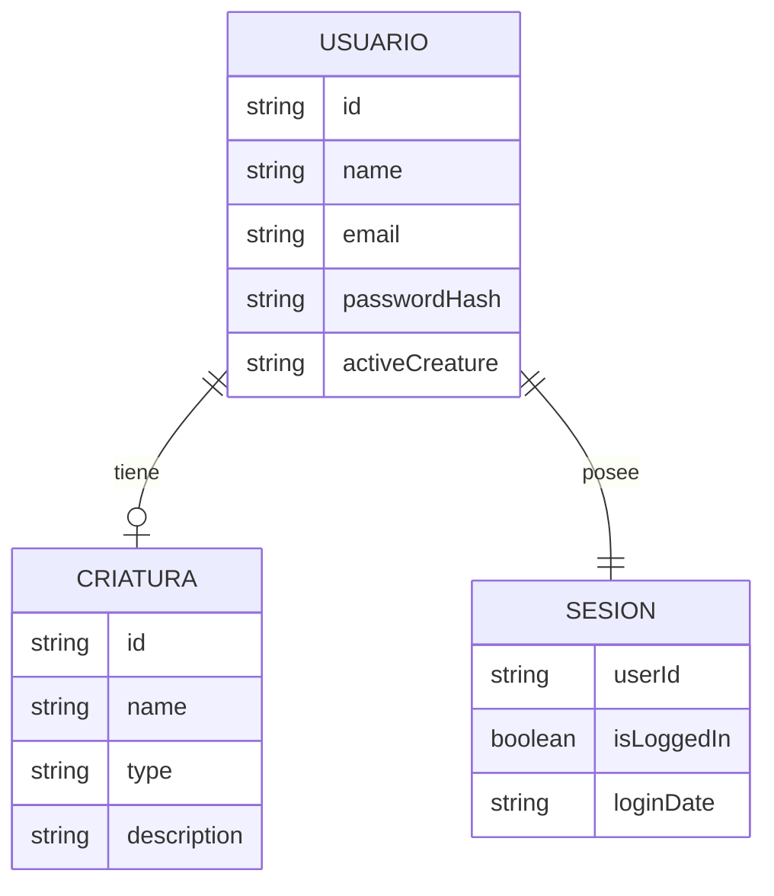

# Diseño de base de datos

## Estado actual
En esta etapa del proyecto no se utiliza una base de datos relacional o remota formal.  
La persistencia de información se realiza mediante `localStorage` del navegador.

Aun así, el sistema fue diseñado con una estructura lógica de datos que puede migrarse fácilmente a una base de datos real como:
- PostgreSQL
- MongoDB
- MySQL

## Entidades principales

### 1. Usuario
Representa a cada persona registrada dentro del sistema.

Campos principales:
- `id`
- `name`
- `email`
- `passwordHash`
- `activeCreature`

### 2. Criatura
Representa el personaje o criatura seleccionable dentro del sistema.

Campos principales:
- `id`
- `name`
- `type`
- `description`
- `stats`

### 3. Sesión
Representa el estado activo de autenticación de un usuario.

Campos principales:
- `userId`
- `isLoggedIn`
- `loginDate`

## Relación entre entidades
- Un **usuario** puede tener **una criatura activa**
- Una **sesión** pertenece a **un usuario**
- A futuro, un usuario podrá tener varias criaturas, progreso y partidas

## Modelo lógico propuesto



## Justificación del diseño
Se planteó este diseño porque cubre las necesidades actuales del sistema:
- identificación del usuario,
- control de acceso,
- selección de personaje,
- persistencia de estado.

Además, este modelo permite crecer a futuro para agregar:
- estadísticas,
- inventario,
- partidas,
- historial,
- ranking,
- multijugador.

## Ejemplo de estructura en JavaScript

```js
const user = {
  id: "u001",
  name: "Yerick",
  email: "usuario@email.com",
  passwordHash: "hash_generado",
  activeCreature: "axolotl"
};

const session = {
  userId: "u001",
  isLoggedIn: true,
  loginDate: "2026-04-22"
};
```

## Posible script SQL futuro
Si el sistema se migra a una base de datos relacional, podría usarse una estructura como esta:

```sql
CREATE TABLE users (
  id VARCHAR(50) PRIMARY KEY,
  name VARCHAR(100) NOT NULL,
  email VARCHAR(100) UNIQUE NOT NULL,
  password_hash TEXT NOT NULL,
  active_creature VARCHAR(50)
);

CREATE TABLE creatures (
  id VARCHAR(50) PRIMARY KEY,
  name VARCHAR(100) NOT NULL,
  type VARCHAR(50),
  description TEXT
);

CREATE TABLE sessions (
  user_id VARCHAR(50) PRIMARY KEY,
  is_logged_in BOOLEAN NOT NULL,
  login_date TIMESTAMP,
  CONSTRAINT fk_user
    FOREIGN KEY (user_id)
    REFERENCES users(id)
);
```

## Conclusión
Aunque actualmente la persistencia es local, el diseño de datos ya contempla una transición ordenada hacia una base de datos real, manteniendo coherencia con la evolución técnica del proyecto.
