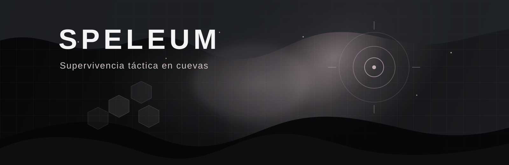

<div align="center">


</div>

# SPELEUM — Juego web de supervivencia táctica en cuevas

Speleum es un proyecto académico de videojuego web centrado en supervivencia táctica dentro de cuevas oscuras. El jugador controla una criatura subterránea, se mueve por tiles con visión limitada, interpreta señales mediante radar, combate amenazas y compite por ser el utlimo en pie.

## Objetivo del proyecto

Desarrollar un multijugador jugable que combine diseño de juego, frontend interactivo, persistencia de datos y una base de tiempo real. El proyecto busca demostrar integración entre experiencia visual, lógica táctica, autenticación, ranking y una primera aproximación a multijugador con salas.

## Estado actual del sistema

Speleum se encuentra en una versión MVP académica funcional. El sistema ya integra autenticación, perfil de usuario, ranking persistido, selección de criatura, guardado de resultados y una partida local jugable con visión limitada, radar, ataque, defensa y criaturas hostiles.

Además, incluye una base multijugador con salas privadas en tiempo real mediante Socket.IO. Esa parte ya funciona como fundamento técnico, pero todavía está en etapa de mejora y no debe interpretarse como una solución lista para producción.

## Funcionalidades implementadas

- Landing page temática del proyecto.
- Login y registro de usuarios.
- Verificación por código para registro e inicio de sesión.
- Gestión de sesión autenticada.
- Soporte bilingüe en interfaz principal (Español/Inglés) con persistencia local.
- Soporte de tema claro / oscuro con modo oscuro por defecto y persistencia local.
- Perfil de usuario con estadísticas básicas.
- Preferencias de usuario para idioma y tema desde la sección de perfil.
- Selección y persistencia de criatura activa.
- Ranking persistido en base de datos.
- Guardado de resultados de partida.
- Partida local jugable.
- Visión limitada sobre el mapa.
- Movimiento táctico por tiles.
- Radar de señales y ruido.
- Ataque, defensa y cooldowns.
- Criaturas hostiles con comportamiento base.
- Salas privadas multijugador con Socket.IO.
- Documentación técnica del proyecto en `docs/`.

## Funcionalidades en desarrollo o pendientes

- Estabilizar mejor las partidas en tiempo real.
- Pulir sincronización de movimiento, combate y señales en multijugador.
- Mejorar reconexión y manejo de salida de salas.
- Afinar historial de partidas y registro de ganador.
- Enriquecer estadísticas del perfil.
- Mejorar responsive del modo de juego.
- Ampliar variedad de criaturas, amenazas y balance de combate.
- Fortalecer validaciones y seguridad para un entorno de producción.
- Incorporar capturas reales del sistema para documentación y presentación.

## Tecnologías utilizadas

| Área | Tecnologías |
| --- | --- |
| Frontend | Next.js 16, React 19, TypeScript |
| Estilos e interfaz | Tailwind CSS 4, Framer Motion, Lucide React |
| Persistencia | PostgreSQL, Prisma ORM |
| Tiempo real | Socket.IO y `socket.io-client` |
| Backend integrado | Route Handlers de Next.js App Router |
| Utilidades de desarrollo | ESLint, TSX, Concurrently |
| Correo transaccional opcional | Integración con Resend vía API |

## Arquitectura general

- El frontend está construido con Next.js y React usando App Router.
- La interfaz utiliza Tailwind CSS y animaciones con Framer Motion.
- La persistencia principal se maneja con PostgreSQL mediante Prisma.
- Las operaciones de autenticación, perfil, ranking y resultados se exponen mediante APIs internas de Next.js.
- El multijugador usa un servidor Socket.IO separado del frontend.
- La lógica de juego local y parte de la lógica multijugador comparten una base común de reglas y estados.
- El modo local es la parte más madura del sistema; el modo multijugador ya es funcional, pero aún requiere estabilización adicional.

## Estructura del proyecto

```text
.
├── app/            # Frontend, rutas App Router y APIs internas
├── docs/           # Documentación técnica y de apoyo
├── lib/            # Utilidades de auth, Prisma, sockets y lógica compartida
├── prisma/         # Schema de base de datos
├── public/         # Recursos estáticos, logos e ilustraciones
├── server/         # Servidor Socket.IO para salas en tiempo real
└── README.md       # Presentación principal del proyecto
```

### Organización destacada de `app/`

- `app/page.tsx`: landing principal.
- `app/login/`: acceso y verificación.
- `app/profile/`: perfil y estadísticas básicas del usuario.
- `app/ranking/`: vista de ranking persistido.
- `app/play/`: partida local, selección de criatura y flujo multijugador.
- `app/api/`: endpoints internos para auth, perfil, ranking y resultados.

## Documentación técnica

- [Arquitectura](./docs/ARQUITECTURA.md)
- [Base de datos](./docs/BASE_DE_DATOS.md)
- [Servicios y módulos](./docs/SERVICIOS.md)
- [Ejecución del proyecto](./docs/EJECUCION.md)
- [Mejoras futuras](./docs/MEJORAS_FUTURAS.md)
- [Diseño del juego](./docs/DISENO_JUEGO_SPELEUM.md)
- [Uso de IA](./docs/USO_IA.md)

## Requisitos previos

- Node.js 20 o superior
- npm
- PostgreSQL disponible
- Archivo `.env` configurado

## Variables de entorno

No existe un `.env.example` en este repositorio al momento de esta revisión. La siguiente tabla se construyó a partir del código y la documentación existente.

| Variable | Nivel | Uso |
| --- | --- | --- |
| `DATABASE_URL` | Requerida | Conexión principal de Prisma a PostgreSQL. |
| `DIRECT_URL` | Requerida | Conexión directa usada por Prisma para operaciones de base de datos. |
| `SESSION_SECRET` | Requerida | Firma de sesión autenticada. |
| `AUTH_CODE_SECRET` | Recomendada | Firma de códigos de autenticación y verificación. |
| `RESEND_API_KEY` | Recomendada | Envío real de correos con Resend. |
| `EMAIL_FROM` | Recomendada | Remitente de correos de autenticación. |
| `NEXT_PUBLIC_SOCKET_URL` | Recomendada | URL pública del servidor Socket.IO. Si no existe, el modo multijugador no se habilita. |
| `FRONTEND_URL` | Recomendada | Origen permitido para el servidor de sockets. |
| `NEXT_PUBLIC_APP_URL` | Recomendada | URL pública de la aplicación para integraciones y CORS. |
| `ALLOWED_ORIGINS` | Recomendada | Lista adicional de orígenes permitidos para Socket.IO. |
| `DEMO_AUTH_CODES` | Opcional para demo/desarrollo | Habilita flujo de códigos de demostración. |
| `DEMO_AUTH_CODES_PUBLIC` | Opcional para demo/desarrollo | Expone el código demo al cliente cuando corresponde. |
| `AUTH_RESEND_COOLDOWN_SECONDS` | Opcional para demo/desarrollo | Cooldown entre reenvíos de código. |
| `AUTH_MAX_VERIFY_ATTEMPTS` | Opcional para demo/desarrollo | Límite de intentos de verificación. |
| `AUTH_MAX_RESENDS` | Opcional para demo/desarrollo | Límite de reenvíos por desafío. |
| `AUTH_RATE_LIMIT_WINDOW_MINUTES` | Opcional para demo/desarrollo | Ventana de rate limiting. |
| `AUTH_RATE_LIMIT_PER_EMAIL` | Opcional para demo/desarrollo | Límite por correo. |
| `AUTH_RATE_LIMIT_PER_IP` | Opcional para demo/desarrollo | Límite por IP. |
| `PORT` | Opcional | Puerto del servidor Socket.IO. Por defecto usa `4001`. |

## Instalación y ejecución local

1. Instalar dependencias:

```bash
npm install
```

2. Generar el cliente de Prisma:

```bash
npx prisma generate
```

3. Aplicar migraciones en desarrollo:

```bash
npx prisma migrate dev
```

4. Iniciar el frontend:

```bash
npm run dev
```

5. Iniciar el servidor de sockets si se va a probar multijugador:

```bash
npm run socket
```

6. Levantar frontend y sockets en paralelo:

```bash
npm run dev:full
```

## Comandos principales

| Comando | Descripción |
| --- | --- |
| `npm install` | Instala dependencias del proyecto. |
| `npm run dev` | Ejecuta el frontend de Next.js en desarrollo. |
| `npm run socket` | Inicia el servidor Socket.IO. |
| `npm run server` | Alias para iniciar el servidor Socket.IO. |
| `npm run dev:full` | Ejecuta frontend y sockets en paralelo. |
| `npm run dev:all` | Ejecuta frontend y servidor usando los aliases definidos. |
| `npm run lint` | Ejecuta ESLint. |
| `npm run build` | Genera cliente Prisma y compila Next.js. |
| `npm run start` | Inicia la aplicación compilada. |
| `npm run db:migrate:deploy` | Aplica migraciones de Prisma para despliegue. |
| `npx prisma generate` | Regenera manualmente el cliente Prisma. |
| `npx prisma migrate dev` | Aplica migraciones en desarrollo. |
| `npx prisma migrate deploy` | Aplica migraciones en despliegue. |
| `npx tsc --noEmit` | Verificación de tipos recomendada. |

## Build y despliegue

- El frontend Next.js puede desplegarse en plataformas como Vercel.
- La base de datos requiere una instancia PostgreSQL accesible desde el entorno desplegado.
- Prisma necesita generar cliente y aplicar migraciones antes de operar con el schema actual.
- El servidor Socket.IO corre por separado y necesita un entorno persistente propio si se desea multijugador real en producción.
- Vercel puede servir bien el frontend, pero no debe presentarse por sí solo como solución completa para sockets persistentes.
- Si `NEXT_PUBLIC_SOCKET_URL` no está configurada, el proyecto sigue permitiendo autenticación, perfil, ranking y partida local.

## Evidencia visual

Actualmente el repositorio no incluye capturas reales de la interfaz o de partidas dentro de `public/`. Para una presentación más sólida en GitHub, profesor o entrevista, conviene agregar:

- Landing
- Login / registro
- Perfil
- Partida local
- Ranking
- Multijugador

## Uso de inteligencia artificial

Durante el desarrollo de Speleum se utilizó inteligencia artificial como apoyo para organización de ideas, redacción de documentación, revisión de estructura y asistencia puntual en diseño y desarrollo.

La IA no reemplazó la implementación del proyecto. Las decisiones finales, la integración y la validación del resultado quedaron bajo control del autor.

## Autor

**Yerick Mondragón**

- GitHub: (https://github.com/Yerickmondra15)
- LinkedIn: www.linkedin.com/in/yerick-mondragon-sancho-a396473b0
- Institución: Cedes Don Bosco
- Año: 2026
