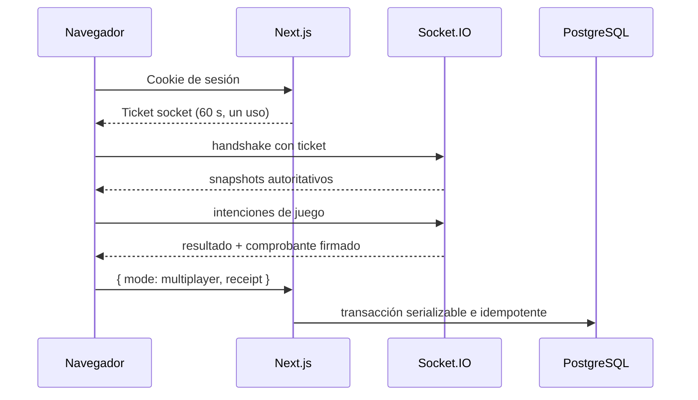

# Arquitectura de Speleum

## Componentes

### Next.js

La aplicación usa App Router para interfaz y endpoints. Las rutas de autenticación, perfil, ranking, criatura activa, tickets y resultados validan datos en tiempo de ejecución con Zod. Prisma es el único acceso a PostgreSQL.

### Cliente de juego

`app/play/` contiene configuración, mapa de tiles, generación de cuevas, lógica táctica pura y componentes React. El modo local ejecuta el bucle en el navegador y se declara no competitivo. El cliente multijugador muestra snapshots del servidor y envía únicamente intenciones.

### Socket.IO

`server/socketServer.ts` solo inicia el proceso. La composición está en `server/createSocketServer.ts` y las responsabilidades se separan en:

```text
server/
├── auth/socketAuth.ts
├── game/scoring.ts
├── handlers/
│   ├── connectionHandlers.ts
│   ├── gameplayHandlers.ts
│   └── roomHandlers.ts
├── rooms/
│   ├── roomLifecycle.ts
│   ├── roomSerialization.ts
│   └── roomStore.ts
├── validation/socketSchemas.ts
├── config.ts
└── types.ts
```

Las salas, referencias de sockets y tickets consumidos son memoria local del proceso.

### Seguridad compartida sin código de navegador

`lib/security/`, `lib/multiplayer/`, `lib/matches/` y `lib/validation/` contienen tokens HMAC, tickets, comprobantes, políticas y esquemas. Los módulos que manejan secretos solo se invocan desde servidor/API.

## Flujo de identidad y resultado



## Decisiones

- Local y multijugador tienen niveles de confianza distintos.
- `userId`, `player.id` y `socket.id` nunca se intercambian.
- Los códigos de sala sirven para descubrimiento, no autenticación.
- La lógica de modificadores de criatura es común; el servidor sigue siendo autoridad en multijugador.
- El ciclo de vida usa tres intervalos cerrables, no un `setTimeout` por acción.

## Límites

No hay Redis, adaptador distribuido, cola ni persistencia de salas. Un reinicio invalida reconexión y partidas activas. El patrón de comprobante evita dar acceso directo a PostgreSQL al servidor de sockets, pero depende del cliente para entregar el comprobante a la API.
