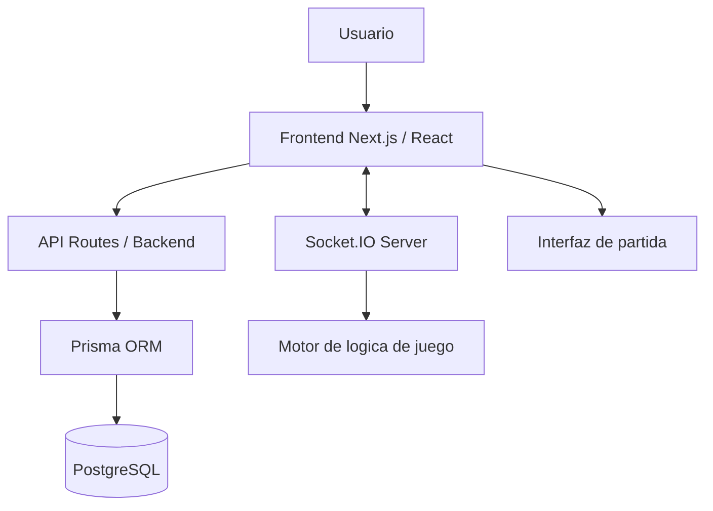

# Arquitectura de Speleum

## Enfoque general

Speleum utiliza una arquitectura cliente-servidor con frontend y backend integrados en Next.js App Router, persistencia en PostgreSQL mediante Prisma y comunicacion en tiempo real con Socket.IO para el modo multijugador.

## Componentes principales

### Frontend

- Interfaz construida con React sobre Next.js.
- Pantallas para landing, login, perfil, ranking, mundo, guia y partida.
- Componentes de juego para radar, HUD, mapa, seleccion de criatura y salas.

### Backend y API

- Route Handlers de Next.js para autenticacion, perfil, ranking y guardado de resultados.
- Manejo de sesion desde el servidor.
- Validacion de datos antes de escribir en base de datos.

### Base de datos

- PostgreSQL como almacenamiento principal.
- Prisma como ORM y capa de acceso.
- Persistencia de usuarios, retos de autenticacion, estadisticas y resultados.

### Motor de logica de juego

- Modulo compartido para movimiento por tiles, vision limitada, combate, radar y comportamiento de amenazas.
- Soporta partida local y sirve como base para la sincronizacion multijugador.

### Modulo de ranking

- Consulta de estadisticas acumuladas.
- Presentacion ordenada por puntuacion y actividad reciente.

### Modulo de autenticacion

- Registro y login con codigo enviado al correo.
- Sesiones persistidas mediante cookies firmadas.

### Modulo de multijugador

- Servidor Socket.IO separado del frontend.
- Salas privadas por codigo.
- Sincronizacion de movimiento, ataque, defensa, enemigos y senales de radar.

## Comunicacion entre componentes

- El cliente consume APIs HTTP para autenticacion, perfil, ranking y resultados.
- Prisma conecta el backend con PostgreSQL.
- Socket.IO comunica eventos de partida y actualiza el estado de las salas en tiempo real.
- El motor de juego alimenta tanto la partida local como la logica usada por el servidor multijugador.

## Flujo resumido

1. El usuario accede al frontend.
2. El frontend consulta APIs para autenticacion y datos persistidos.
3. El backend procesa solicitudes y usa Prisma para interactuar con PostgreSQL.
4. Si el usuario entra a multijugador, el cliente abre conexion Socket.IO.
5. El servidor de sockets administra salas, combate, movimiento y senales.
6. El frontend renderiza el estado visible segun vision limitada y radar.

## Diagrama Mermaid

## Observaciones de implementacion

- La partida local ya funciona de forma completa como prototipo integrado.
- El multijugador ya cuenta con base funcional en tiempo real y esta preparado para seguir ampliandose.
- La visibilidad parcial y el radar estan pensados para sugerir actividad, no para revelar informacion perfecta.
