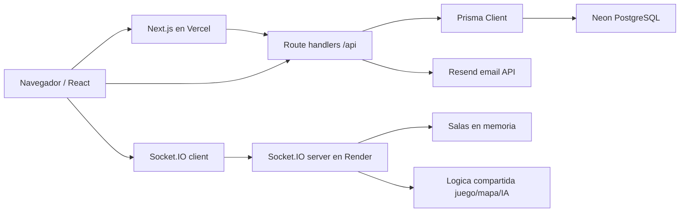

# Speleum - Connections and deployment audit

Este documento cubre Neon/Prisma, Socket.IO/Render, Vercel, correo y variables de entorno.

## Neon y Prisma

Conexion:

- `prisma/schema.prisma` usa datasource PostgreSQL.
- `url = env("DATABASE_URL")`
- `directUrl = env("DIRECT_URL")`
- `lib/prisma.ts` crea `PrismaClient` singleton en desarrollo.
- `package.json` ejecuta `postinstall: prisma generate`.
- `build` ejecuta `prisma generate && next build`.

Variables esperadas:

- `DATABASE_URL`: conexion principal, usualmente pooled en Neon.
- `DIRECT_URL`: conexion directa para migraciones.

Migraciones:

- `20260511022301_init`: User, UserStats, Match, MatchResult.
- `20260513153000_email_auth_challenges`: campos de verificacion en User y AuthChallenge.
- `migration_lock.toml`: provider PostgreSQL.

No se comprobo:

- Conexion real a Neon.
- `prisma migrate deploy` contra una DB.
- Pooling real de la URL, porque no se deben exponer valores.

Riesgos:

- No existe `.env.example`.
- `.env` local contiene `DatabaseURL`, que no es usada por Prisma por capitalizacion/nombre.
- Si `DATABASE_URL` o `DIRECT_URL` faltan, `prisma generate` puede pasar, pero runtime/migraciones fallaran.
- En Vercel, multiples instancias serverless pueden crear varios PrismaClient; el singleton ayuda solo dentro de un runtime caliente.

## Socket.IO y Render

Archivo principal:

- `server/socketServer.ts`

Arranque:

- `npm run socket` o `npm run server`: `tsx server/socketServer.ts`.
- `PORT = Number(process.env.PORT) || 4001`.
- `HOST = "0.0.0.0"`.

CORS:

- Permitidos por defecto: `http://localhost:3000`, `http://127.0.0.1:3000`, `http://localhost:4001`, `http://127.0.0.1:4001`.
- Env agregados: `NEXT_PUBLIC_APP_URL`, `FRONTEND_URL`, `ALLOWED_ORIGINS` separados por coma.
- Regex permite `https://[a-z0-9-]+.vercel.app`.

URL cliente:

- `lib/socket.ts` usa `NEXT_PUBLIC_SOCKET_URL`.
- Fallback solo local: `http://localhost:4001`.
- En produccion sin `NEXT_PUBLIC_SOCKET_URL`, `getSocket()` retorna null.

Estado en memoria:

- `rooms = new Map<string, ServerRoomState>()`.
- Room contiene mapa, lookup, status, players, enemies, signals, noises, winner, results.
- Se pierde al reiniciar Render.

Arranque probado:

- `npm run server` se intento.
- Primer intento no emitio salida antes del timeout y dejo proceso escuchando.
- Segundo intento fallo con `EADDRINUSE 0.0.0.0:4001`.
- Se cerraron los procesos `npm/tsx/server/socketServer.ts` iniciados en este workspace.

### Eventos Socket.IO

| Evento Socket.IO | Emisor | Receptor | Datos | Archivo | Estado | Problemas |
| --- | --- | --- | --- | --- | --- | --- |
| `create-room` | Cliente lobby | Servidor | `name`, `characterId` | `MultiplayerMenu.tsx`, `socketServer.ts` | Funcional | Sin auth; characterId no validado estrictamente. |
| `join-room` | Cliente lobby | Servidor | `roomCode`, `name`, `characterId` | mismos | Funcional | No hay reconexion; max por `room.players.size`, incluye left. |
| `player-ready` | Cliente lobby | Servidor | `roomCode` | mismos | Funcional | Ready permanente hasta start; no unready. |
| `player-move` | Cliente juego | Servidor | `roomCode`, `target` o `direction` | `MultiplayerGame.tsx`, `socketServer.ts` | Funcional | Server valida ruta/cooldown; cliente puede spam pero recibe errores. |
| `player-attack` | Cliente juego | Servidor | `roomCode` | mismos | Funcional | Server decide targets en rango; no requiere target. |
| `player-defend` | Cliente juego | Servidor | `roomCode` | mismos | Funcional | Server valida cooldown/stun. |
| `leave-room` | Cliente juego/lobby | Servidor | `roomCode` | `MultiplayerMenu.tsx`, `MultiplayerGame.tsx` | Funcional | En partida elimina jugador. |
| `disconnect` | Socket.IO | Servidor | impl. Socket.IO | `socketServer.ts` | Funcional agresivo | Elimina jugador en partida; sin gracia/reconnect. |
| `game-state` | Servidor | Cliente | `MultiplayerStatePayload` | `socketServer.ts`, clients | Funcional | Incluye cueva completa; otros jugadores/enemigos filtrados por vision. |
| `game-over` | Servidor | Cliente | winner/results/message | `socketServer.ts`, `MultiplayerGame.tsx` | Funcional | Persistencia DB la hace cliente despues. |
| `player-left` | Servidor | Cliente | roomCode/playerId/message | server/clients | Funcional | Puede interrumpir UX; no diferencia disconnect temporal. |
| `error-message` | Servidor | Cliente | string | server/clients | Funcional | Mensajes solo espanol. |

## Vercel

Build:

- `npm run build` pasa localmente.
- Next reporta rutas estaticas y dinamicas.
- Build carga `.env` local.

Rutas dependientes de serverless:

- Todas las rutas `app/api/**`.
- Prisma se usa en APIs.
- Socket.IO no corre dentro de Next/Vercel; requiere Render u otro proceso persistente.

Variables necesarias:

- `DATABASE_URL`, `DIRECT_URL`, `SESSION_SECRET`, `AUTH_CODE_SECRET` recomendado, `RESEND_API_KEY`, `EMAIL_FROM`, `NEXT_PUBLIC_SOCKET_URL`.

Riesgos:

- Cookies `secure` solo produccion; correcto en HTTPS.
- Sin middleware para rutas privadas.
- Dominio personalizado requiere actualizar `FRONTEND_URL`/`ALLOWED_ORIGINS` en Render y posiblemente `NEXT_PUBLIC_APP_URL`.
- Vercel previews quedan permitidos por regex broad en Socket.IO.
- No hay `vercel.json`, `render.yaml` ni docs de env exactas en repo.

## Correo electronico

Proveedor real:

- Resend API HTTP.

Archivos:

- `lib/auth-email.ts`
- `lib/auth-challenge.ts`
- `app/api/auth/register/route.ts`
- `app/api/auth/login/route.ts`
- `app/api/auth/resend-code/route.ts`

Variables:

- `RESEND_API_KEY`
- `EMAIL_FROM`
- `DEMO_AUTH_CODES`
- `DEMO_AUTH_CODES_PUBLIC`

Flujo:

1. Endpoint emite codigo de 6 digitos.
2. Guarda HMAC en `AuthChallenge`.
3. Envia email con Resend.
4. Si falla y demo no esta activo, devuelve error.
5. Usuario verifica codigo.

Produccion:

- Debe usarse dominio verificado en Resend.
- Hay que configurar SPF/DKIM segun Resend.
- `EMAIL_FROM` debe pertenecer al dominio verificado.
- `onboarding@resend.dev` no es recomendable para producto final.

## Inventario de variables de entorno

| Variable | Parte que la usa | Cliente o servidor | Obligatoria | Desarrollo | Produccion | Riesgo si falta |
| --- | --- | --- | --- | --- | --- | --- |
| `DATABASE_URL` | Prisma datasource | Servidor | Si | DB local/Neon | Neon pooled | APIs Prisma fallan. |
| `DIRECT_URL` | Prisma datasource directUrl | Servidor | Si para migraciones | DB local/Neon | Neon direct | Migraciones fallan. |
| `SESSION_SECRET` | `lib/auth-session.ts`, fallback auth code | Servidor | Si | Puede tener dev secret | Debe existir | Cookie firmada con fallback. |
| `AUTH_CODE_SECRET` | `lib/auth-challenge.ts` | Servidor | Recomendado | Opcional | Debe existir | Codigos HMAC usan fallback. |
| `AUTH_RESEND_COOLDOWN_SECONDS` | AuthChallenge | Servidor | No | default 60 | Configurable | Reenvio no ajustado. |
| `AUTH_MAX_VERIFY_ATTEMPTS` | AuthChallenge | Servidor | No | default 5 | Configurable | Intentos no ajustados. |
| `AUTH_MAX_RESENDS` | AuthChallenge | Servidor | No | default 5 | Configurable | Reenvios no ajustados. |
| `AUTH_RATE_LIMIT_WINDOW_MINUTES` | AuthChallenge | Servidor | No | default 60 | Configurable | Rate limit de retos no ajustado. |
| `AUTH_RATE_LIMIT_PER_EMAIL` | AuthChallenge | Servidor | No | default 6 | Configurable | Abuso por email. |
| `AUTH_RATE_LIMIT_PER_IP` | AuthChallenge | Servidor | No | default 12 | Configurable | Abuso por IP. |
| `DEMO_AUTH_CODES` | Auth endpoints | Servidor | No | Util para demo | No recomendado | Puede permitir flujo sin email real. |
| `DEMO_AUTH_CODES_PUBLIC` | AuthChallenge response | Servidor/cliente por respuesta | No | Solo demo local | No | Expone codigos en UI. |
| `RESEND_API_KEY` | `lib/auth-email.ts` | Servidor | Si para correo real | Opcional si demo | Si | Registro/login por correo fallan. |
| `EMAIL_FROM` | `lib/auth-email.ts` | Servidor | Recomendado | default Resend | Si | Entregabilidad/dominio. |
| `NEXT_PUBLIC_SOCKET_URL` | `lib/socket.ts` | Cliente | Si para prod multi | fallback localhost | Si | Multijugador deshabilitado. |
| `PORT` | `server/socketServer.ts` | Servidor Socket | Render lo define | default 4001 | Render | Puerto incorrecto. |
| `NEXT_PUBLIC_APP_URL` | Socket CORS | Servidor Socket | No | Opcional | Recomendado | CORS puede bloquear dominio. |
| `FRONTEND_URL` | Socket CORS | Servidor Socket | No | Opcional | Recomendado | CORS puede bloquear dominio. |
| `ALLOWED_ORIGINS` | Socket CORS | Servidor Socket | No | Opcional | Recomendado | CORS incompleto. |
| `NODE_ENV` | Cookies/Prisma logs | Servidor | Automatico | dev | production | secure cookie/log behavior. |
| `DatabaseURL` | Ninguna | Ninguna | No | Declarada localmente | No | Variable muerta/confusion. |

Variables declaradas pero no usadas:

- `DatabaseURL` en `.env` local.

Variables usadas pero no documentadas en `.env.example`:

- Todas, porque no existe `.env.example`.

Variables publicas sensibles:

- `NEXT_PUBLIC_SOCKET_URL` es publica por diseno. No debe contener secretos.

URLs hardcodeadas:

- `http://localhost:4001` en `lib/socket.ts`.
- Localhost origins en `server/socketServer.ts`.
- `https://api.resend.com/emails` en `lib/auth-email.ts`.

## Diagrama textual

## Problemas importantes

### [HIGH] No existe `.env.example`

**Estado:** Confirmado  
**Archivo:** raiz del proyecto  
**Simbolo relacionado:** variables de entorno  
**Sistema:** Conexiones / Despliegue  
**Descripcion:** El repo tiene `.env` ignorado, pero no plantilla segura.

**Evidencia:** `rg --files -g '.env*'` encontro solo `.env`; `.gitignore` ignora `.env`.

**Consecuencia:** Vercel/Render/Neon se configuran a mano y con alto riesgo de olvidar variables.

**Como reproducirlo:** Buscar `.env.example`.

**Recomendacion:** Crear `.env.example` sin secretos y documentar cada variable.

**Dependencias afectadas:** Build, auth, email, DB, socket.

### [HIGH] Socket.IO depende de URL publica obligatoria en produccion

**Estado:** Confirmado  
**Archivo:** `lib/socket.ts`  
**Simbolo relacionado:** `resolveSocketUrl`  
**Sistema:** Conexiones / Multijugador  
**Descripcion:** En hostname no local, si falta `NEXT_PUBLIC_SOCKET_URL`, no hay socket.

**Evidencia:** `resolveSocketUrl` retorna null fuera de localhost si no hay env.

**Consecuencia:** Boton multijugador queda inutil en produccion mal configurada.

**Como reproducirlo:** Abrir app produccion sin env.

**Recomendacion:** Configurar env en Vercel y mostrar diagnostico claro en UI.

**Dependencias afectadas:** Lobby, partida multiplayer.

### [MEDIUM] CORS permite todos los previews `*.vercel.app`

**Estado:** Confirmado  
**Archivo:** `server/socketServer.ts`  
**Simbolo relacionado:** `vercelPreviewOrigin`  
**Sistema:** Conexiones / Seguridad  
**Descripcion:** Cualquier subdominio simple de `vercel.app` pasa CORS del socket.

**Evidencia:** Regex `^https:\/\/[a-z0-9-]+\.vercel\.app$`.

**Consecuencia:** Superficie amplia para conexiones desde previews no controlados.

**Como reproducirlo:** Origin de otro proyecto Vercel que coincida.

**Recomendacion:** Restringir a `ALLOWED_ORIGINS` explicito o patron del proyecto.

**Dependencias afectadas:** Socket.IO, despliegue previews.
