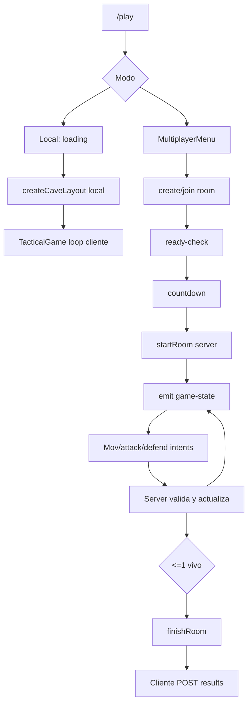
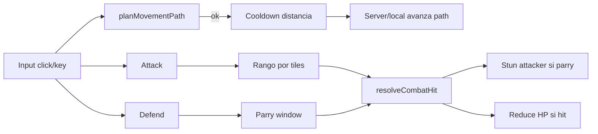
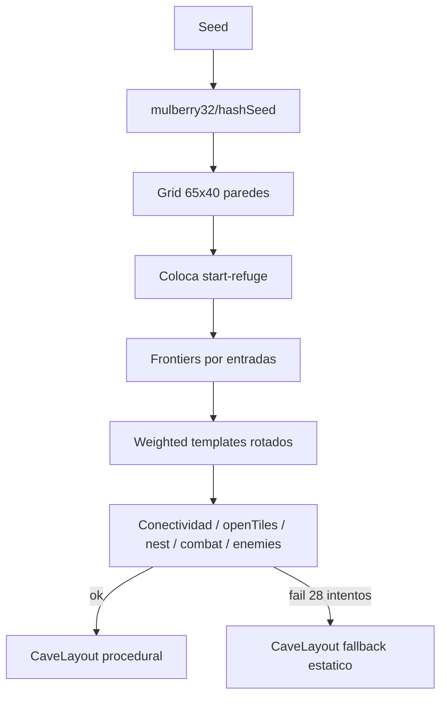
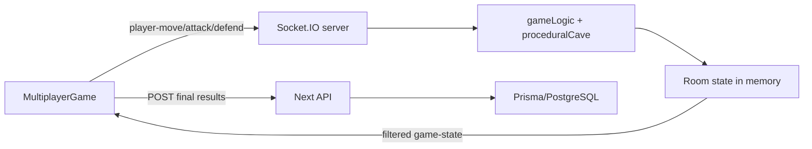
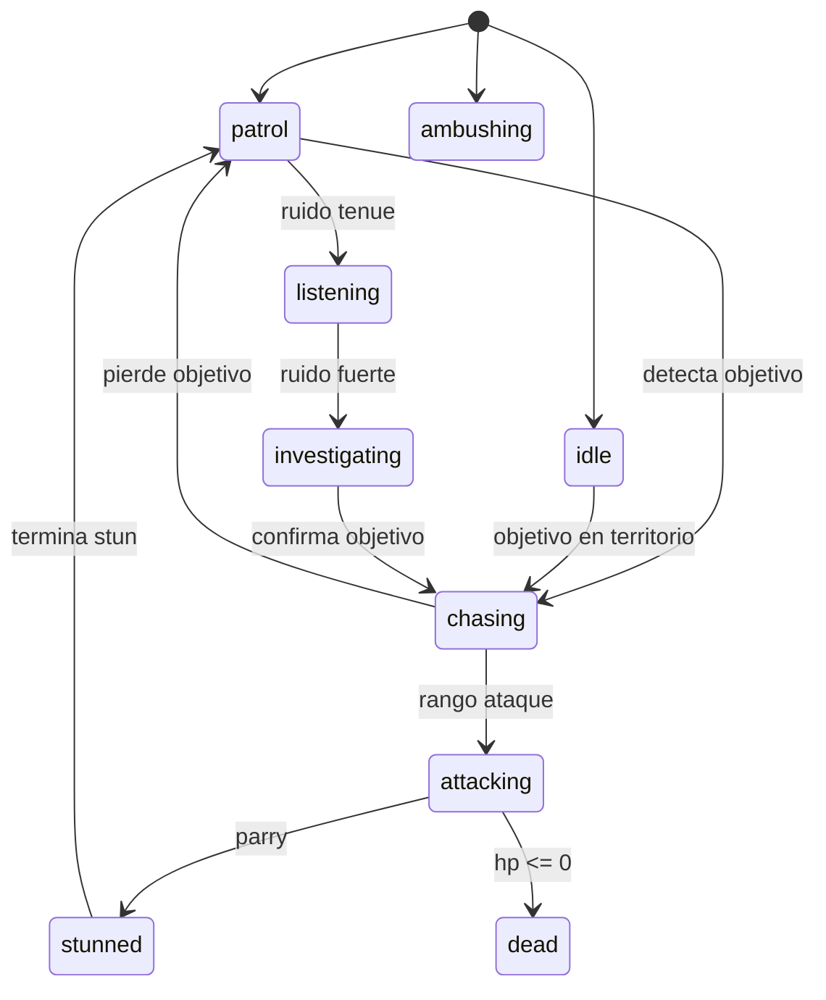

# Speleum - Game, map and multiplayer audit

Este documento es independiente para trabajar en juego, mapa, IA, radar y multijugador. Ver tambien [00-MASTER-STATUS.md](./00-MASTER-STATUS.md).

## Arquitectura del juego

Punto de entrada:

- `/play` -> `app/play/page.tsx` -> `PlayScene`.
- `PlayScene` redirige a login si `AuthProvider.status === "signed-out"`.
- Modo local: `TacticalGame`.
- Modo multijugador: `MultiplayerMenu` -> `MultiplayerGame`.

Logica compartida:

- Constantes/config: `app/play/gameConfig.ts`.
- Movimiento, colisiones, combate, IA, spawns: `app/play/gameLogic.ts`.
- Tiles/pathfinding/radar aproximado: `app/play/tileMap.ts`.
- Cueva procedural: `app/play/proceduralCave.ts`.
- Senales radar: `app/play/signalUtils.ts`.
- Tipos: `app/play/types.ts`.

Render:

- `GameMap` renderiza tiles, jugador, enemigos, otros jugadores visibles, senales y paths.
- `GameHud`, `RadarPanel`, `ActionControls`, `GameOverlay` renderizan UI.

Estado local:

- `TacticalGame` mantiene jugador, enemigos, salud, cooldowns, parry, stun, score, signals, noises y cueva en React state.
- Enemy loop con `setInterval` cada `ENEMY_MOVE_INTERVAL`.
- Movimiento por path con `setInterval` cada `MOVEMENT_STEP_INTERVAL_MS`.

Estado multijugador:

- `server/socketServer.ts` mantiene estado autoritativo en memoria.
- Cliente recibe `MultiplayerStatePayload`.
- Cliente solo emite intenciones (`player-move`, `player-attack`, `player-defend`).

## Sistemas principales

| Sistema | Archivo | Funciones principales | Estado | Problemas |
| --- | --- | --- | --- | --- |
| Movimiento por tiles | `gameLogic.ts`, `tileMap.ts` | `planMovementPath`, `buildPathToTile`, `findReachableTiles` | Funcional | Cliente local y server multi comparten pathfinding; cooldown por distancia. |
| Colisiones | `gameLogic.ts`, `tileMap.ts` | `canStandAt`, `canTravelBetween`, `isWalkableTile` | Funcional | Hazard es walkable; mata luego en multi, en local no se ve muerte por hazard en flujo principal. |
| Cooldown movimiento | `gameLogic.ts` | `calculateMoveCooldown` | Funcional | Multijugador valida server-side; local valida cliente. |
| Ataque | `TacticalGame.tsx`, `socketServer.ts` | `handleAttack`, `player-attack` | Funcional con diferencias | Local ataca enemigo mas cercano; multi ataca todos los objetivos en rango. |
| Defensa/parry | `gameLogic.ts`, `TacticalGame.tsx`, `socketServer.ts` | `resolveCombatHit`, `handleDefend` | Funcional | Mensajes y damage difieren entre local/multi. |
| Stun | `gameLogic.ts` | `isStunned`, `canTakeTurn` | Funcional | UI muestra estado; server valida. |
| Vida/dano/muerte | `gameLogic.ts`, `socketServer.ts` | `applyDamage`, `eliminatePlayer`, `finishRoom` | Funcional | Persistencia final no autoritativa en DB. |
| Victoria/derrota local | `TacticalGame.tsx` | `endAsWin`, `endAsLoss` | Parcial | Gana al matar criaturas; no hay otros jugadores, no es Battle Royale real. |
| Victoria/derrota multi | `socketServer.ts` | `evaluateRoom`, `finishRoom` | Funcional | Si queda 1 jugador vivo gana; desconexion elimina. |
| Pausa/UI hidden | `TacticalGame.tsx`, `GameTopControls.tsx` | `handleTogglePause`, `isUiHidden` | Local funcional | Multiplayer no tiene pausa, solo ocultar UI. |
| HUD/radar | `GameHud.tsx`, `RadarPanel.tsx` | props de cooldown/senales | Funcional | No comprobado visualmente en movil. |
| Sonido | N/A | N/A | No implementado | No hay audio. |

## Flujo completo de partida

| Paso | Estado | Evidencia | Observacion |
| --- | --- | --- | --- |
| 1. Usuario entra a `/play` | Implementado | `PlayScene` | Redireccion cliente si no hay sesion. |
| 2. Selecciona local o multijugador | Implementado | `PlayMenu` | Local simula searching/loading. |
| 3. Crea o une sala | Implementado | `MultiplayerMenu`, `create-room`, `join-room` | Codigo de 6 caracteres. |
| 4. Ready | Implementado | `player-ready`, `syncLobbyState` | No hay unready. |
| 5. Countdown | Implementado | `START_COUNTDOWN_MS = 5000` | Ready-check window 30s. |
| 6. Genera/carga mapa | Implementado | `createCaveLayout` | Local seed aleatoria; multi seed `room:${roomCode}` server-side. |
| 7. Asigna spawns | Parcial | `pickSeparatedSpawns` | Server reasigna al start; lobby usa spawn temporal. |
| 8. Comienza partida | Implementado | `startRoom` | Status `playing`. |
| 9. Movimiento | Implementado | `planMovementPath` | Server autoritativo en multi. |
| 10. Ataque/defensa | Implementado | `player-attack`, `player-defend` | Multi no elige target; server aplica a todos en rango. |
| 11. Enemigos reaccionan | Implementado | `updateEnemyState` | Stalker/territorial/wanderer/ambusher/aggressive. |
| 12. Sincroniza estado | Implementado | `emitState` | Filtra enemigos/jugadores/senales por vision. |
| 13. Jugador muere | Implementado | `eliminatePlayer` | Disconnect cuenta como perdida en partida. |
| 14. Termina partida | Implementado | `finishRoom` | Cuando vivos <= 1. |
| 15. Determina ganador | Implementado en memoria | `winnerId` | No vinculado a User.id. |
| 16. Guarda resultados | Parcial/Inseguro | `MultiplayerGame` fetch | Cliente calcula score y POST. |
| 17. Actualiza ranking | Parcial/Inseguro | `/api/matches/results` | Ranking no confiable. |

## Local frente a multijugador

| Mecanica | Local | Multijugador | Usa el mismo codigo | Diferencias | Problemas |
| --- | --- | --- | --- | --- | --- |
| Mapa | `createCaveLayout(local-seed)` cliente | `createCaveLayout(room:CODE)` servidor | Si | Local genera cliente; multi recibe layout | Multi consistente; local no comparte. |
| Movimiento | Cliente calcula y aplica | Cliente previsualiza, servidor aplica | `planMovementPath` | Server authoritative en multi | OK. |
| Ataque | Target enemigo mas cercano | Todos jugadores/enemigos en rango | `isAttackReachableByTiles` | Resultado diferente | Balance inconsistente. |
| Defensa/parry | Cliente local | Servidor | `resolveCombatHit` | Local vs multi mensajes/damage | OK con diferencias. |
| Enemigos | Cliente local | Servidor | `updateEnemyState` | Damage local usa config; server usa `CAVE_ATTACK_DAMAGE` para ataques enemigos | Inconsistencia. |
| Radar | Cliente local | Servidor genera y filtra | `createRadarSignal`, `upsertRadarSignal` | Multi filtra por vision | OK. |
| Resultado DB | Cliente local | Cliente multi | No server-side DB | Ambos manipulables | BLOCKER. |
| Pausa | Si | No | No | Multi solo oculta UI | Esperable. |

## Autoridad del servidor

Multijugador:

- Calcula servidor: mapa inicial, spawns al inicio, movimiento paso a paso, cooldowns, ataque, dano, parry, stun, IA, muerte, ganador.
- Valida servidor: sala/status, socket pertenece a sala, cooldown movimiento/ataque/parry, stun, path caminable, rango de ataque.
- Calcula cliente: preview de path, UI, guardado de ranking DB, score persistido.

Trampas posibles:

- Cliente no puede enviar posicion final arbitraria si `planMovementPath` falla en server.
- Cliente no puede saltarse cooldowns de movimiento/ataque/parry en server.
- Cliente no puede declarar muerte/ganador en Socket.IO.
- Cliente si puede manipular DB de resultados llamando `/api/matches/results`.
- Cliente puede elegir `characterId` arbitrario al socket; server usa fallback de `characterOptions` para multiplicadores, pero estado puede contener ID no valido.
- Socket no esta autenticado; cualquiera que conozca URL puede crear/unirse salas.

Conclusion: el servidor Socket.IO es autoritativo para la partida en memoria, pero no para identidad persistente ni estadisticas.

## Generacion del mapa

Representacion:

- `CAVE_WIDTH = 5200`, `CAVE_HEIGHT = 3200`.
- `TILE_SIZE = 80`.
- `MAP_COLS = 65`, `MAP_ROWS = 40`.
- `tileRows: string[]` con caracteres:
  - `#`: wall
  - `H`: hazard
  - `W`: water/hazard
  - `S`: spawn candidate
  - `N`: nest/POI
  - `R`: shelter/spawn candidate
  - `.` o chars abiertos: floor

Algoritmo:

- `generateProceduralCave(seed)` usa `mulberry32(hashSeed(seed))`.
- Crea grid de paredes.
- Coloca template inicial `start-refuge` en origen aleatorio.
- Usa frontiers/entrances para conectar templates.
- Objetivo: `10 + floor(random()*4)` secciones.
- Hasta 28 intentos.
- Valida:
  - minimo 8 placements
  - max deadEnds 8
  - conectividad >= 95% de tiles abiertos
  - openTiles entre 280 y 1320
  - al menos un nest
  - al menos una combat chamber
  - al menos un enemyConfig
- Si falla, fallback estatico con `createFallbackCaveLayout`.

Templates:

- `start-refuge`, `narrow-tunnel`, `wide-tunnel`, `spider-nest`, `wet-chamber`, `water-pocket`, `danger-pocket`, `combat-chamber`, `broken-passage`, `temporary-shelter`.
- Se expanden rotaciones 0-3 con `expandTemplateRotations`.

Mapa "infinito":

- No es infinito.
- Siempre esta limitado por 65 x 40 tiles.
- Cambia seed y disposicion, pero dentro del mismo rectangulo.
- Combina secciones prefabricadas rotadas.
- Las secciones no tienen posiciones fijas, salvo fallback estatico.
- En local se regenera al iniciar/reiniciar.
- En multi se genera al crear sala y todos reciben el mismo `room.cave`.

Riesgos:

- Puede caer a fallback si validacion falla.
- `buildLayoutFromPlacements` toma `spawnCandidates` cerca del start para `multiplayerSpawnPositions`, lo que puede sesgar spawns iniciales.
- `pickSeparatedSpawns` luego busca candidatos globales y separa, pero arranca con preferred tiles.
- No hay pruebas automatizadas de conectividad/spawns.

Respuestas directas:

- El mapa se genera proceduralmente: Si, confirmado.
- Solamente elige entre disenos prefabricados: Parcial; combina templates prefabricados con seed/rotacion/posicion.
- Combina secciones: Si.
- Secciones con posiciones fijas: No en procedural; si en fallback.
- El tamano cambia: No, siempre 5200 x 3200.
- La semilla cambia: Local si; multi depende del codigo de sala.
- Se genera una sola vez: Por partida/sala.
- Todos los jugadores ven el mismo mapa: En multi si, lo genera servidor y lo envia.
- Hay codigo nuevo no utilizado: No para `createCaveLayout`; si se usa local y server.
- Funcion procedural desconectada: No.
- Funcion anterior sobrescribe mapa: `tileMap` exporta fallback estatico por defecto, pero local/multi pasan layout procedural a `buildTileMap`; las funciones default pueden usarse si alguien omite lookup.
- Posiciones hardcodeadas: Si en fallback y constantes legacy `startPosition`, `multiplayerSpawnPositions`.
- Mapa infinito funciona: No existe.
- Que limita tamano: `CAVE_WIDTH`, `CAVE_HEIGHT`, `MAP_COLS`, `MAP_ROWS`.
- Puede generar zonas inaccesibles: Valida 95% conectividad, no 100%; posible pequeno residuo aislado.
- Puede dejar jugadores atrapados: Mitigado por safe spawn/pathfinding, no probado exhaustivamente.
- Puede afectar rendimiento: Tile grid 2600 celdas, razonable; pathfinding frecuente podria costar en clientes modestos pero no se midio.

## Spawns de jugadores

Local:

- Jugador inicia en `caveSession.layout.startPosition`.
- Este punto viene del primer `S`/`R` encontrado en templates o fallback `startPosition`.
- No hay otros jugadores.

Multijugador:

- Al crear/unirse lobby, posicion temporal:
  - creador: `cave.multiplayerSpawnPositions[0] ?? cave.startPosition`
  - join: `roomSpawnAt(room, room.players.size)` usando `pickSeparatedSpawns`.
- Al iniciar partida, `startRoom` recalcula `spawnPositions = pickSeparatedSpawns(room.cave, room.tileLookup, playerEntries.length)` y asigna por orden de `playerEntries`.

Clasificacion actual:

- No es spawn fijo puro en procedural.
- Es semialeatorio/deterministico por seed de sala y orden de entrada.
- Depende del orden de entrada para asignar posicion.
- Usa lista preferida de `layout.startPosition` y `layout.multiplayerSpawnPositions`, pero luego puede elegir walkableCandidates.
- Server asigna spawns en multi.
- Cliente asigna solo local.
- Distancia minima: `PLAYER_SPAWN_MIN_DISTANCE_TILES = 10` en `pickSeparatedSpawns`.
- Evita hazard/enemy por buffers.
- No valida distancia a paredes mas alla de tile walkable.

Diseno recomendado:

- El servidor debe elegir todos los spawns al iniciar partida.
- Candidatos: solo tiles caminables, no hazard, con vecinos caminables suficientes.
- Excluir tiles cerca de paredes, enemigos y hazards.
- Usar seed de sala + nonce de partida.
- Elegir conjunto maximizando distancia entre jugadores.
- No usar posicion permanente por jugador ni orden como factor principal visible.
- Reintentar con distancia decreciente si el mapa es pequeno.
- Nunca asignar dos jugadores al mismo tile.
- Guardar spawns elegidos en estado de sala para reconexion.

## IA y criaturas

Tipos confirmados:

- `stalker`
- `territorial`
- `wanderer`
- `ambusher`
- `aggressive`

Estados implementados:

- `idle`
- `patrol`
- `listening`
- `investigating`
- `ambushing`
- `chasing`
- `attacking`
- `stunned`
- `dead`

No existe literalmente `alerted`; su equivalente real es `listening`/`investigating`/`chasing`.

Comportamientos:

- Territorial: vuelve a home si sale de territorio y queda `idle` en home.
- Ambusher: puede quedarse `ambushing` ante ruido.
- Wanderer: umbral auditivo mas bajo.
- Stalker/aggressive: persiguen segun deteccion/ruido.

Sincronizacion:

- Local: IA corre en cliente.
- Multi: IA corre en servidor y solo se envian enemigos visibles.

## Radar y senales

Senales:

- Tipos: `move`, `attack`, `defend`, `danger`.
- Perfiles en `RADAR_SIGNAL_PROFILES`: fuerza, duracion, jitter.
- Buffer maximo 24.
- Movimiento y defensa se fusionan si son del mismo owner, tipo y cercanas en tiempo/posicion.

Local:

- Jugador y enemigos generan senales y ruidos.
- Radar muestra senales cercanas por `RADAR_SIGNAL_RANGE_TILES`.

Multijugador:

- Servidor genera senales/ruidos.
- `emitState` filtra senales dentro de `VISION_RADIUS`.
- `RadarPanel` vuelve a aproximar posicion con jitter.

Riesgos:

- `RadarSignal.id = createdAt`; dos senales en el mismo ms podrian colisionar como key.
- En multi, el servidor filtra por vision radius, no por radar range; puede limitar senales que deberian oirse fuera de vision.
- No hay garantia de entrega si cliente desconecta.

## Errores reproducibles del juego

| Comando | Resultado | Error | Posible causa | Bloquea produccion |
| --- | --- | --- | --- | --- |
| `npm run lint` | OK | Ninguno | N/A | No |
| `npx tsc --noEmit` | OK | Ninguno | N/A | No |
| `npm run build` | OK | Ninguno | N/A | No |
| `npm run server` | Fallo operativo en segundo intento | `EADDRINUSE 0.0.0.0:4001` | Primer intento con timeout dejo proceso escuchando, o puerto ocupado | No si Render asigna puerto; si dev local tiene puerto ocupado, si |

## Diagramas

### Flujo de partida

### Movimiento y combate

### Generacion del mapa

### Cliente-servidor

### Estados IA

## Problemas importantes

### [BLOCKER] Reconexion declarada pero no implementada como continuidad de jugador

**Estado:** Confirmado  
**Archivo:** `server/socketServer.ts`, `app/play/components/MultiplayerGame.tsx`  
**Simbolo relacionado:** `disconnect`, `handleReconnectAttempt`  
**Sistema:** Multijugador  
**Descripcion:** Socket.IO reconecta transporte, pero el jugador de la sala no se recupera.

**Evidencia:** Server usa `socket.id`; en `disconnect` elimina o marca left.

**Consecuencia:** Partidas moviles/Render sleep son fragiles.

**Como reproducirlo:** Desconectar socket durante partida.

**Recomendacion:** Token de rejoin con ventana de gracia.

**Dependencias afectadas:** Room state, resultados, UX.

### [HIGH] El mapa no es infinito ni cambia de tamano

**Estado:** Confirmado  
**Archivo:** `app/play/gameConfig.ts`, `app/play/proceduralCave.ts`  
**Simbolo relacionado:** `CAVE_WIDTH`, `CAVE_HEIGHT`, `MAP_COLS`, `MAP_ROWS`  
**Sistema:** Mapa  
**Descripcion:** El procedural combina secciones, pero dentro de un tablero fijo.

**Evidencia:** `CAVE_WIDTH=5200`, `CAVE_HEIGHT=3200`, `MAP_COLS=65`, `MAP_ROWS=40`.

**Consecuencia:** Si se esperaba mapa infinito o altamente expansible, no esta implementado.

**Como reproducirlo:** Revisar layout generado; siempre tiene 40 filas.

**Recomendacion:** Mantener finito para entrega; documentar alcance real.

**Dependencias afectadas:** Spawns, rendimiento, UI minimap/radar.

### [HIGH] Guardado de resultados multijugador no sale del servidor autoritativo

**Estado:** Confirmado  
**Archivo:** `app/play/components/MultiplayerGame.tsx`, `app/api/matches/results/route.ts`  
**Simbolo relacionado:** `fetch("/api/matches/results")`  
**Sistema:** Multijugador / Backend  
**Descripcion:** El server decide ganador en memoria, pero el cliente persiste resultado y puntaje.

**Evidencia:** `MultiplayerGame` calcula `scoreEarned` y `winnerId` para POST.

**Consecuencia:** Estadisticas manipulables.

**Como reproducirlo:** Modificar request cliente.

**Recomendacion:** Persistir desde `socketServer.ts` hacia API interna o DB con secreto.

**Dependencias afectadas:** Ranking, perfil, match history.
